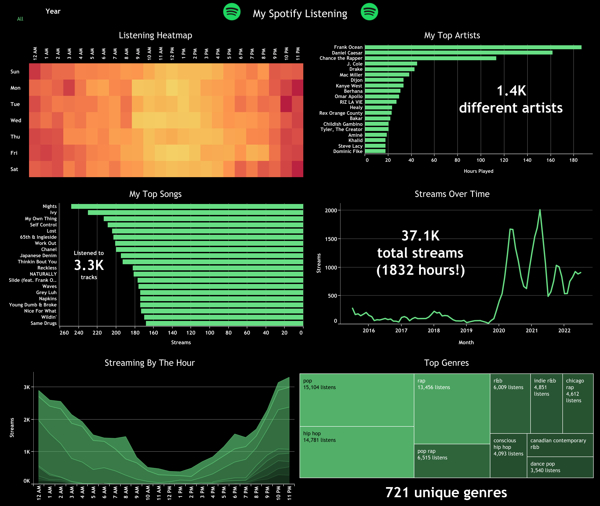

# Analyzing Spotify Listening History With Tableau!

In this repository, I've included some files that I used in order to analyze my Spotify listening history using Tableau! Hope you find it useful as well.

## How to use:

Pre-requisites:
- Familiarity with PostgreSQL (and a running server/database)
- Tableau (of course!)
- Your technical Spotify listening information (obtained by emailing <a href='mailto:privacy@spotify.com'>privacy@spotify.com</a>).
- A database GUI (i.e., <a href='https://dbeaver.io' rel='noopener noreferrer' >DBeaver</a>), if you prefer.

1. Run [create.sql](create.sql) to create the necessary tables in your database.
2. Add your *endsong_#.json* files to the array on line 13 in [insert_data.py](insert_data.py). Also make sure to add the client id and client secret variables for the Spotify API (lines 66-67).
3. Install the necessary packages and run [insert_data.py](insert_data.py)! Make sure to ensure it is connected to your database properly.
4. Set your database as a datasource in the Tableau workbook.
5. Enjoy your listening history visualized!